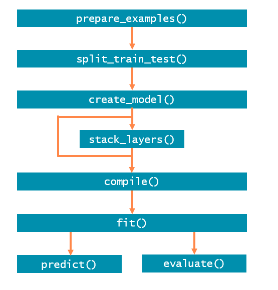
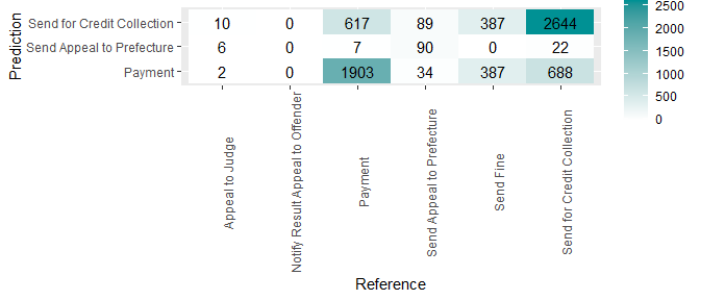

```{r, include = FALSE}
knitr::opts_chunk$set(
  collapse = TRUE,
  comment = "#>",
  eval = FALSE,
  cache = FALSE
)
```

```{r setup, message = F, eval = T}
library(processpredictR)
library(bupaR)
library(ggplot2)
library(dplyr)
library(keras)
library(purrr)
```

# Introduction
The goal of processpredictR is to perform prediction tasks on processes using event logs and Transformer models.
The 5 process monitoring tasks are defined as follows:

* _outcome_: predict the case outcome, which can be the last activity, or a manually defined variable
* _next activity_: predict the next activity instance 
* _remaining trace_: predict the sequence of all next activity instances
* _next time_: predict the start time of the next activity instance
* _remaining time_: predict the remaining time till the end of the case

The overall approach using `processpredictR` is shown in the Figure below. `prepare_examples()` transforms logs into a dataset that can be used for training and prediction, which is thereafter split into train and test set. Subsequently a model is made, compiled and fit. Finally, the model can be used to predict and can be evaluated

```{r echo = F, eval = T, out.width = "60%", fig.align = "center"}

```

Different levels of customization are offered. Using `create_model()`, a standard off-the-shelf model can be created for each of the supported tasks, including standard features. 

A first customization is to include additional features, such as case or event attributes. These can be configured in the `prepare_examples()` step, and they will be processed automatically (normalized for numerical features, or hot-encoded for categorical features). 

A further way to customize your model, is to only generate the input layer of the model with `create_model()`, and define the remainder of the model yourself by adding `keras` layers using the provided `stack_layers()` function. 

Going beyond that, you can also create the model entirely yourself using `keras`, including the preprocessing of the data. Auxiliary functions are provided to help you with, e.g., tokenizing activity sequences. 

In the remainder of this tutorial, each of the steps and possible avenues for customization will be described in more detail. 

# Preprocessing
As a first step in the process prediction workflow we use `prepare_examples()` to obtain a dataset, where: 

* each row/observation is a unique activity instance id
* the prefix(_list) column stores the sequence of activities already executed in the case
* necessary features and target variables are calculated and/or added

The returned object is of class `ppred_examples_df`, which inherits from `tbl_df`. 

In this tutorial we will use the `traffic_fines` event log from `eventdataR`. Note that both `eventlog` and `activitylog` objects, as defined by `bupaR` are supported.

```{r, eval = T}
df <- prepare_examples(traffic_fines, task = "outcome")
df
```

We split the transformed dataset `df` into train- and test sets for later use in `fit()` and `predict()`, respectively. The proportion of the train set is configured with the `split` argument. 

```{r, eval = T}
set.seed(123)
split <- df %>% split_train_test(split = 0.8)
split$train_df %>% head(5)
split$test_df %>% head(5)
```

It's important to note that the split is done at case level (a case is fully part of either the train data or either the test data). Furthermore, the split is done chronologically, meaning that the train set contains the split\% first cases, and the test set contains the (1-split)\% last cases. 

Note that because the split is done at case level, the percentage of all examples in the train set can be slightly different, as cases differ with respect their length. 

```{r, eval = T}
nrow(split$train_df) / nrow(df)
n_distinct(split$train_df$case_id) / n_distinct(df$case_id)
```

# Transformer model

The next step in the workflow is to build a model. `processpredictR` provides a default set of functions that are wrappers of generics provided by `keras`. For ease of use, the preprocessing steps, such as tokenizing of sequences, normalizing numerical features, etc. happen within the `create_model()` function and are abstracted from the user. 

## Define model

Based on the train set we define the default transformer model, using `create_model()`.

```{r}
model <- split$train_df %>% create_model(name = "my_model") 
# pass arguments as ... that are applicable to keras::keras_model()

model # is a list 
```

```
#> Model: "my_model"
#> ________________________________________________________________________________
#>  Layer (type)                       Output Shape                    Param #     
#> ================================================================================
#>  input_1 (InputLayer)               [(None, 9)]                     0           
#>  token_and_position_embedding (Toke  (None, 9, 36)                  792         
#>  nAndPositionEmbedding)                                                         
#>  transformer_block (TransformerBloc  (None, 9, 36)                  26056       
#>  k)                                                                             
#>  global_average_pooling1d (GlobalAv  (None, 36)                     0           
#>  eragePooling1D)                                                                
#>  dropout_3 (Dropout)                (None, 36)                      0           
#>  dense_3 (Dense)                    (None, 64)                      2368        
#>  dropout_2 (Dropout)                (None, 64)                      0           
#>  dense_2 (Dense)                    (None, 6)                       390         
#> ================================================================================
#> Total params: 29,606
#> Trainable params: 29,606
#> Non-trainable params: 0
#> ________________________________________________________________________________
```

Some useful information and metrics are stored for a tracebility and an easy extraction if needed.
```{r}
model %>% names() # objects from a returned list
```
```
#> $names
#> [1] "model"           "max_case_length" "number_features" "task"           
#> [5] "num_outputs"     "vocabulary"     

```

Note that `create_model()` returns a list, in which the actual keras model is stored under the element name `model`. Thus, we can use functions from the keras-package as follows:

```{r}
model$model$name # get the name of a model
```
```
#> [1] "my_model"

```
```{r}
model$model$non_trainable_variables # list of non-trainable parameters of a model
```
```
#> list()
```

The result of `create_model()` is assigned it's own class (`ppred_model`) for which the `processpredictR` provides the methods _compile()_, _fit()_, _predict()_ and _evaluate()_. 

## Compilation

The following step is to compile the model. By default, the loss function is the log-cosh or the categorical cross entropy, for regression tasks (next time and remaining time) and classification tasks, respectively. It is of course possible to override the defaults.

```{r}
model %>% compile() # model compilation
```

```
#> Compilation complete!
```

## Training

Training of the model is done with the `fit()` function. During training, a visualization window will open in the Viewer-pane to show the progress in terms of loss. Optionally, the result of `fit()` can be assigned to an object to access the training metrics specified in _compile()_. 

```{r}
hist <- fit(object = model, train_data = split$train_df, epochs = 5)
```

```{r}
hist$params
```

```
#> $verbose
#> [1] 1
#> 
#> $epochs
#> [1] 5
#> 
#> $steps
#> [1] 2227
```
```{r}
hist$metrics
```
```
#> $loss
#> [1] 0.7875332 0.7410239 0.7388409 0.7385073 0.7363014
#> 
#> $sparse_categorical_accuracy
#> [1] 0.6539739 0.6713067 0.6730579 0.6735967 0.6747193
#> 
#> $val_loss
#> [1] 0.7307042 0.7261314 0.7407018 0.7326428 0.7317348
#> 
#> $val_sparse_categorical_accuracy
#> [1] 0.6725934 0.6727730 0.6725934 0.6725934 0.6722342
``` 

## Make predictions

The method  _predict()_ can return 3 types of output, by setting the argument `output` to "append", "y_pred" or "raw". 

Test dataset with appended predicted values (output = "append")

```{r}
predictions <- model %>% predict(test_data = split$test_df, 
                                 output = "append") # default
predictions %>% head(5)
```

```
#> # A tibble: 5 × 13
#>   ith_case case_id prefix                prefix_…¹ outcome     k activ…² resou…³
#>      <int> <chr>   <chr>                 <list>    <fct>   <dbl> <chr>   <fct>  
#> 1     8001 A24869  Create Fine           <chr [1]> Payment     0 Create… 559    
#> 2     8001 A24869  Create Fine - Payment <chr [2]> Payment     1 Payment <NA>   
#> 3     8002 A24871  Create Fine           <chr [1]> Payment     0 Create… 559    
#> 4     8002 A24871  Create Fine - Payment <chr [2]> Payment     1 Payment <NA>   
#> 5     8003 A24872  Create Fine           <chr [1]> Send f…     0 Create… 559    
#> # … with 5 more variables: start_time <dttm>, end_time <dttm>,
#> #   remaining_trace_list <list>, y_pred <dbl>, pred_outcome <chr>, and
#> #   abbreviated variable names ¹​prefix_list, ²​activity, ³​resource
``` 

<details>
<summary>raw predicted values (output = "raw")</summary>
<p>
```
#>              Payment Send for Credit Collection    Send Fine
#>    [1,] 4.966056e-01                0.344094276 1.423686e-01
#>    [2,] 9.984029e-01                0.001501600 8.890528e-05
#>    [3,] 4.966056e-01                0.344094276 1.423686e-01
#>    [4,] 9.984029e-01                0.001501600 8.890528e-05
#>    [5,] 4.966056e-01                0.344094276 1.423686e-01
#>    [6,] 1.556145e-01                0.518976271 2.884890e-01
#>    [7,] 2.345311e-01                0.715000629 5.147375e-06
#>    [8,] 2.627363e-01                0.726804197 5.480492e-06
#>    [9,] 3.347774e-05                0.999961376 2.501280e-08
#>   [10,] 4.966056e-01                0.344094276 1.423686e-01
```
</details>
</p>

<details>
<summary>predicted values with postprocessing (output = "y_pred")</summary>
```
#>    [1] "Payment"                    "Payment"                   
#>    [3] "Payment"                    "Payment"                   
#>    [5] "Payment"                    "Send for Credit Collection"
#>    [7] "Send for Credit Collection" "Send for Credit Collection"
#>    [9] "Send for Credit Collection" "Payment"                   
#>   [11] "Send for Credit Collection" "Payment"                   
#>   [13] "Send for Credit Collection" "Payment"                   
#>   [15] "Send for Credit Collection" "Send for Credit Collection"
#>   [17] "Send for Credit Collection" "Send for Credit Collection"
#>   [19] "Payment"                    "Send for Credit Collection"
```
</details>
</p>

### Visualize predictions
For the classification tasks outcome and next activity a `confusion_matrix()` function is provided. 

```{r}
predictions %>% class
```
```
#> [1] "ppred_predictions" "ppred_examples_df" "ppred_examples_df"
#> [4] "ppred_examples_df" "tbl_df"            "tbl"              
#> [7] "data.frame"
```
```{r}
confusion_matrix(predictions)
```
```
#>                                   
#>                                    Payment Send Appeal to Prefecture
#>   Appeal to Judge                        2                         6
#>   Notify Result Appeal to Offender       0                         0
#>   Payment                             1903                         7
#>   Send Appeal to Prefecture             34                        90
#>   Send Fine                            387                         0
#>   Send for Credit Collection           688                        22
#>                                   
#>                                    Send for Credit Collection
#>   Appeal to Judge                                          10
#>   Notify Result Appeal to Offender                          0
#>   Payment                                                 617
#>   Send Appeal to Prefecture                                89
#>   Send Fine                                               387
#>   Send for Credit Collection                             2644
```

Plot method for the confusion matrix (classification) or a scatter plot (regression).

```{r, out.width="100%", fig.width = 7}
plot(predictions) +
  theme(axis.text.x = element_text(angle = 90))
```

```{r, out.width="100%", fig.width = 7} 

```

## Evaluate model

Returns loss and metrics specified in _compile()_.

```{r}
model %>% evaluate(split$test_df)
```

```
#>                        loss sparse_categorical_accuracy 
#>                   0.7779053                   0.6716526
```

# Add extra features 

Next to the activity prefixes in the data, and standard features defined for each task, additional features can be defined when using `prepare_examples()`. The example below shows how the month in which a case is started can be added as a feature. 

```{r}
# preprocessed dataset with categorical hot encoded features
df_next_time <- traffic_fines %>% 
  group_by_case() %>%
  mutate(month = lubridate::month(min(timestamp), label = TRUE)) %>%
  ungroup_eventlog() %>%
  prepare_examples(task = "next_time", features = "month") %>% split_train_test()


```

```{r}
# the attributes of df are added or changed accordingly

df_next_time$train_df %>% attr("features")
```

```
#>  [1] "latest_duration"      "throughput_time"      "processing_time"     
#>  [4] "time_before_activity" "month_jan"            "month_feb"           
#>  [7] "month_mrt"            "month_apr"            "month_mei"           
#> [10] "month_jun"            "month_jul"            "month_aug"           
#> [13] "month_sep"            "month_okt"            "month_nov"           
#> [16] "month_dec"
```

```{r}
df_next_time$train_df %>% attr("hot_encoded_categorical_features")
```

```
#>  [1] "month_jan" "month_feb" "month_mrt" "month_apr" "month_mei" "month_jun"
#>  [7] "month_jul" "month_aug" "month_sep" "month_okt" "month_nov" "month_dec"
```


Additional features can be either numerical variables, or factors. Numerical variables will be automatically normalized. Factors will automatically be converted to hot-encoded variables. A few important notes: 

- Character values are not accepted, and should be transformed to factors. 
- We assume that no features have missing values. If there are any, these should be imputed or removed before using `prepare_examples()`. 
- Finally, in case the data is an event log, features should have single values for each activity instance. Start and complete event should thus have a single unique value of a variable for it to be used as feature. 

# Customize your transformer model

Instead of using the standard `off the shelf` transformer model that comes with `processpredictR`, you can customize the model. One way to do this, is by using the `custom` argument of the `create_model()` function. The resulting model will then only contain the input layers of the model, as shown below. 

```{r}
df <- prepare_examples(traffic_fines, task = "next_activity") %>% split_train_test()
custom_model <- df$train_df %>% create_model(custom = TRUE, name = "my_custom_model")
custom_model
```


```
#> Model: "my_custom_model"
#> ________________________________________________________________________________
#>  Layer (type)                       Output Shape                    Param #     
#> ================================================================================
#>  input_2 (InputLayer)               [(None, 9)]                     0           
#>  token_and_position_embedding_1 (To  (None, 9, 36)                  828         
#>  kenAndPositionEmbedding)                                                       
#>  transformer_block_1 (TransformerBl  (None, 9, 36)                  26056       
#>  ock)                                                                           
#>  global_average_pooling1d_1 (Global  (None, 36)                     0           
#>  AveragePooling1D)                                                              
#> ================================================================================
#> Total params: 26,884
#> Trainable params: 26,884
#> Non-trainable params: 0
#> ________________________________________________________________________________
```

You can than stack layers on top of your custom model as you prefer, using the `stack_layers()` function. This function provides an abstraction from a little bit more code work if `keras` is used (see later).
```{r}
custom_model <- custom_model %>%
  stack_layers(layer_dropout(rate = 0.1)) %>% 
  stack_layers(layer_dense(units = 64, activation = 'relu'))
custom_model
```

```
#> Model: "my_custom_model"
#> ________________________________________________________________________________
#>  Layer (type)                       Output Shape                    Param #     
#> ================================================================================
#>  input_2 (InputLayer)               [(None, 9)]                     0           
#>  token_and_position_embedding_1 (To  (None, 9, 36)                  828         
#>  kenAndPositionEmbedding)                                                       
#>  transformer_block_1 (TransformerBl  (None, 9, 36)                  26056       
#>  ock)                                                                           
#>  global_average_pooling1d_1 (Global  (None, 36)                     0           
#>  AveragePooling1D)                                                              
#>  dropout_6 (Dropout)                (None, 36)                      0           
#>  dense_6 (Dense)                    (None, 64)                      2368        
#> ================================================================================
#> Total params: 29,252
#> Trainable params: 29,252
#> Non-trainable params: 0
#> ________________________________________________________________________________

```

```{r}
# this works too
custom_model %>%
  stack_layers(layer_dropout(rate = 0.1), layer_dense(units = 64, activation = 'relu'))
```

Once you have finalized your model, with an appropriate output-layer (which should have the correct amount of outputs, as recorded in `customer_model$num_outputs` and an appropriate activation function), you can use the `compile()`, `fit()`, `predict()` and `evaluate()` functions as before. 

# Custom training and prediction

We can also opt for setting up and training our model manually, instead of using the provided methods. Note that after defining a model with `keras::keras_model()` the model no longer is of class `ppred_model`.

```{r}
new_outputs <- custom_model$model$output %>% # custom_model$model to access a model and $output to access the outputs of that model
  keras::layer_dropout(rate = 0.1) %>%
  keras::layer_dense(units = custom_model$num_outputs, activation = 'softmax')

custom_model <- keras::keras_model(inputs = custom_model$model$input, outputs = new_outputs, name = "new_custom_model")
custom_model

```

```
#> Model: "new_custom_model"
#> ________________________________________________________________________________
#>  Layer (type)                       Output Shape                    Param #     
#> ================================================================================
#>  input_2 (InputLayer)               [(None, 9)]                     0           
#>  token_and_position_embedding_1 (To  (None, 9, 36)                  828         
#>  kenAndPositionEmbedding)                                                       
#>  transformer_block_1 (TransformerBl  (None, 9, 36)                  26056       
#>  ock)                                                                           
#>  global_average_pooling1d_1 (Global  (None, 36)                     0           
#>  AveragePooling1D)                                                              
#>  dropout_6 (Dropout)                (None, 36)                      0           
#>  dense_6 (Dense)                    (None, 64)                      2368        
#>  dropout_8 (Dropout)                (None, 64)                      0           
#>  dense_8 (Dense)                    (None, 11)                      715         
#> ================================================================================
#> Total params: 29,967
#> Trainable params: 29,967
#> Non-trainable params: 0
#> ________________________________________________________________________________
```

```{r}
# class of the model
custom_model %>% class
```
```
#> [1] "keras.engine.functional.Functional"                     
#> [2] "keras.engine.training.Model"                            
#> [3] "keras.engine.base_layer.Layer"                          
#> [4] "tensorflow.python.module.module.Module"                 
#> [5] "tensorflow.python.trackable.autotrackable.AutoTrackable"
#> [6] "tensorflow.python.trackable.base.Trackable"             
#> [7] "keras.utils.version_utils.LayerVersionSelector"         
#> [8] "keras.utils.version_utils.ModelVersionSelector"         
#> [9] "python.builtin.object"
```
```{r}
# compile
compile(object=custom_model, optimizer = "adam", 
        loss = loss_sparse_categorical_crossentropy(), 
        metrics = metric_sparse_categorical_crossentropy())
```


Before training the model we first must prepare the data, using the `tokenize()` function. 

```{r}
# the trace of activities must be tokenized
tokens_train <- df$train_df %>% tokenize()
map(tokens_train, head) # the output of tokens is a list


```

```
#> $token_x
#> $token_x[[1]]
#> [1] 2
#> 
#> $token_x[[2]]
#> [1] 2 3
#> 
#> $token_x[[3]]
#> [1] 2
#> 
#> $token_x[[4]]
#> [1] 2 4
#> 
#> $token_x[[5]]
#> [1] 2 4 5
#> 
#> $token_x[[6]]
#> [1] 2 4 5 6
#> 
#> 
#> $numeric_features
#> NULL
#> 
#> $categorical_features
#> NULL
#> 
#> $token_y
#> [1] 0 1 2 3 4 5
```

```{r}
# make sequences of equal length
x <- tokens_train$token_x %>% pad_sequences(maxlen = max_case_length(df$train_df), value = 0)
y <- tokens_train$token_y
```

We are now ready to train our custom model (the code below is not being evaluated).
```{r, eval=F}
# train
fit(object = custom_model, x, y, epochs = 10, batch_size = 10) # see also ?keras::fit.keras.engine.training.Model

# predict
tokens_test <- df$test_df %>% tokenize()
x <- tokens_test$token_x %>% pad_sequences(maxlen = max_case_length(df$train_df), value = 0)
predict(custom_model, x)

# evaluate
tokens_test <- df$test_df %>% tokenize()
x <- tokens_test$token_x
# normalize by dividing y_test over the standard deviation of y_train
y <- tokens_test$token_y / sd(tokens_train$token_y)
evaluate(custom_model, x, y)
```


